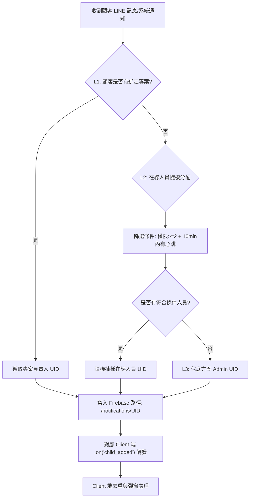
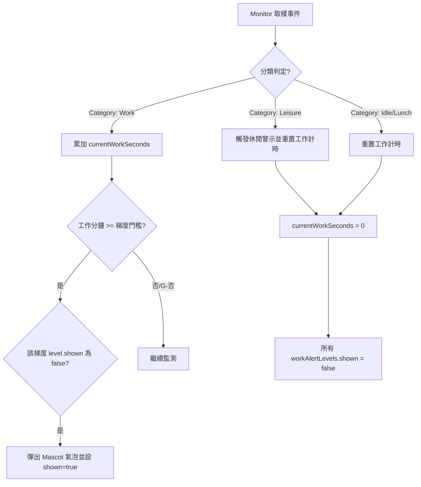

# 添心小助手：MODULE_MAP (技術邏輯)

## 🔄 核心配置與排程周期
| 任務項目 | 執行周期 | 驅動模組 | 目的 |
| :--- | :--- | :--- | :--- |
| **視窗採樣** | 每 15 秒 | `monitor.js` | 偵測工作標題與分類 |
| **背景刷新** | 每 10 分鐘 | `appCore.js` | 同步雲端打卡狀態與 UI |
| **iCloud 同步** | 每 30 分鐘 | `appCore.js` | 抓取 ICS 行事曆數據 |
| **自動報表** | 每 60 分鐘 | `appCore.js` | 數據補位備份 (Upsert) |
| **在線心跳** | 每 5 分鐘 | `monitor.js` | 更新 Firebase 在線名單 |

## 🔄 核心邏輯流程 (SOP)

### 1. 打卡流程 (據點優先、異步強一致性)
- **定位**：組別含「台南/高雄」套用固定座標；其餘採 IP 定位 (`ipapi.co`)。
- **同步**：發送 POST 後 **延遲 2.5 秒** 才執行 `refreshWorkInfo`，防止 Google Sheets 寫入延遲。
- **防禦**：若本地已有打卡紀錄，雲端回傳空值時 **不允許覆寫**。

### 2. 訊息路由 (三階反查分配機制 - Backend 驅動)
- **核心架構**: 由 **GAS (Google Apps Script)** 決定路由，Firebase 作為傳遞介面（Postbox），Client 端僅負責監聽。

- **分配規則 (GAS 邏輯)**:
    - **L1 (專案綁定)**：比對 `顧客列表` UID -> 獲取對應專案號 (如 #730) -> 寫入該專案**負責人**的 Firebase 路徑 (`/notifications/{EmployeeUID}`)。
    - **L2 (在線自動分配)**：若顧客無綁定專案，執行「在線人員分配」。
        - **篩選條件**: 權限 >= 2、10min 內有心跳 (`userStatus` 活躍)、排除主管。
        - **權重分配**: 隨機抽樣在線人員，寫入其專案路徑。
    - **L3 (保底策略)**：若無任何在線人員，強制寫入至 **Admin** 的 Firebase 路徑。
- **過濾與防禦 (Filter/Deduplication) @STABLE**：
    - **內部過濾**: 動作前先經由 `isEmployee` 比對員工 UID，員工間訊息靜默捨棄，不觸發提醒。
    - **Client 去重**: 實作「持久化 ID 濾網」，防止 Firebase Webhook 重試所致之重複提醒。
    - **[NEW] 物理路徑鎖定**: 每個 Client 啟動時僅掛載屬於自己 UID 的 Firebase 直連路徑，確保物理上的隱私隔離。

### 3. 統計時間更新功能：標準動作法則 (SOP)
這是一個**封閉且循環**的完整動作，定義為以下五個階段：

#### 第一階段：感測 (Sensing) - 「環境探測」
- **觸發周期**：每 15 秒執行一次心跳取樣。
- **偵測對象**：呼叫 `active-win` 獲取「最前方視窗」的 `appName` 與 `windowTitle`。
- **閒置過濾**：若系統偵測到超過 **5 分鐘** 無滑鼠/鍵盤活動，此動作標記為 `Idle` 並暫停有效計時。

#### 第二階段：處理 (Processing) - 「特徵分類與計時校準」
- **計時法則**：計算「目前時間」與「上次取樣時間」之差值。
- **物理邊界 (Spike Protection)**：若差值 > 60s (如休眠喚醒)，該次時長強制校準為 **15s**，其餘採實測秒數。
- **分類法則 (Matching Rule)**：
    - 將 `appName` + `windowTitle` 送入分類引擎。
    - **權重優先級**：`工作關鍵字 (Work)` > `休閒關鍵字 (Leisure)`。
    - **保底機制**：無任何匹配時，歸類為 `其他 (Other)`。

#### 第三階段：儲存 (Storage) - 「持久化與內存同步」
- **硬碟寫入**：將該筆紀錄插入 SQLite `activities` 資料表。
- **內存同步**：立即更新 `MonitorService` 內存中的累加變數（如 `currentWorkSeconds += 15`），確保數據即時性。

#### 第四階段：彙整 (Aggregation) - 「全局總計與牆限制」
- **刷新機制**：每 60 秒（或手動開啟視窗時）執行一次全量彙整。
- **數據彙整規則**：
    1. 加總今日資料庫中各 Category 的秒數。
    2. 合併內存中尚未刷入的餘數。
    3. **物理封頂 (Data Wall)**：單日各類別總計執行 **720 分鐘 (12h)** 封頂，防止異常數據溢出。

#### 第五階段：視覺化 (Visualization) - 「最終輸出」
- **渲染對象**：
    - **狀態看板**：顯示當前上班時間、預計下班時間與使用者資訊。

## 📁 檔案職責與 API
- **apiBridge.js**：全系統 **唯一通訊出口**。負責 GAS (/api/report)、iCloud (ICS 每 30min)、Firebase RTDB。
- **reminderService.js**：全系統 **提醒管家 (Reminder Core)**。負責統籌所有來源（iCloud, Firebase, 本地排程）的氣泡彈出、排隊顯示與跨日狀態清算。
    - **智慧雙軌重置機制 (Smart Reset Algorithm - v1.18.7)**:
        - **設計背景**: 解決凌晨時段（00:00-07:00）處理任務後，因日期物理切換導致記錄被抹除的痛點。
        - **物理重置點 (00:00)**: 
            - 系統更新 `lastCheckDate`。
            - 重置所有單日「固定定時任務」（如打卡提醒）。
        - **邏輯重置點 (07:00)**: 
            - 引入 `_lastCycleTag` (作息週期標記)。
            - 若 `currentTime < 07:00`，`cycleTag` 繼承昨日 ID。
            - 真正執行 `day_reset` (清空 `todayStatus`) 的條件為 `_lastCycleTag !== cycleTag`。
        - **狀態鎖定規則**: 凌晨 00:00 ~ 07:00 期間變更的狀態（如點擊完成、稍後、系統已噴氣泡標記）會被物理持久化並在跨越 00:00 時**強制保留**，直到 07:00 方可清算。
    - **氣泡去重指紋機制 (Fired-once Fingerprint Logic)**:
        - **目的**: 徹底杜絕 iCloud 週期性同步（30min）或 Firebase Webhook 重試導致的重複干擾。
        - **指紋構成**: `ReminderID` + `TodayDateTag`。
        - **判定流**: `fireReminder(item)` -> 檢查 `todayStatus[ID].isFired`。
            - 若 `isFired === true` 且 `status !== 'completed'`: 視為同步干擾，靜默攔截。
            - 若 `isFired === undefined`: 執行彈窗 -> 立即設置 `isFired = true` -> 執行 `_saveTodayStatus()` (持久化防禦)。
        - **物理保護**: 為防止 Electron 視窗渲染延遲導致的併發觸發，指紋標記必須在進入 `reminderQueue` **之前**完成寫入。
    - **佇列管理 (Queueing)**:
        - 採用 400ms 緩衝間隔，確保當多筆（如 iCloud 補發 3 筆行程）同時到達時，氣泡能平滑依序彈出。
- **monitor.js**：前景監測與看板核心服務。
    - **【大綱 - 小添小秘書】**：這模組是助理的「眼睛與心情」，每 15 秒掃描一次你在用什麼軟體，自動判別你是「專注戰鬥」還是「充電休息」。它也是你與「小添」互動的主要窗口，負責顯示可愛的對話、幫你打卡、並整理你的 iCloud 待辦清單。它很貼心，如果你專注太久（如 4.5 小時）會出來趕你去休息，如果你點擊任務，它會立刻透過「樂觀更新」幫你勾選，不必等網路轉圈圈。
    - **【技術深度細節 - 用於功能審計】**：
        1. **視窗掃描引擎 (`sample()`)**：
            - **頻率**：15s/次。
            - **分類邏輯**：整合 `ClassifierService`。先匹配「工作集」，再匹配「休閒集」，最後歸類「其他」。
            - **異常防護 (`Spike Protection`)**：偵測時鐘突波（>60s 或 <0s），強制校準為 15s 取樣，防止待機喚醒導致數據膨脹。
        2. **閒置偵測系統 (`getIdleTime`)**：
            - **動態閾值**：休閒類軟體 10min 判定閒置；工作/其他類軟體 5min 判定閒置。
            - **時光回溯**：判定閒置後，今日累計秒數會自動扣除該段閒置時間，確保生產力百分比真實。
- **monitor.js**：全系統 **環境數據採樣與警示大腦 (The Brain)**。負責背景監控、生產力計算與秘書對話調核。
    - **更新頻率與心跳 (Intervals)**:
        - **核心取樣 (Sampling)**：每 **15 秒** 取樣一次前景視窗。若偵測到 >60s 的時間跳變（如休眠喚醒），自動校準為 15s 以防數據灌水。
        - **iCloud 同步**：啟動 5s 首刷，隨後每 **30 分鐘** 定時同步一次行事曆。
        - **Firebase 心跳**：每 **5 分鐘** 向雲端回傳一次在線狀態與當前應用程式。
    - **秘書報告系統 (Mascot Report / MDQ)**:
        - **MDQ 隊列管理**: 
            - 播報器每 **1 秒** 輪詢隊列是否有待播訊息。
            - 具備優先級覆蓋：LINE 緊急訊息 (Priority 1) > 操作反饋 (Priority 2) > 閒聊 (Priority 3)。
            - 重要訊息保留鎖 (Queue Lock)：顯示後 **10 秒** 內禁止被同優先級或低優先級訊息覆蓋。
        - **自動閒聊 (Idle Chat)**：若連續 **15 分鐘** 無任何動態訊息，秘書將主動觸發閒聊。
    - **統計中心數據刷新 (Stats Center)**:
        - 視窗開啟時，每 **60 秒** 執行一次全量數據對齊 (`refreshStats`)，包含生產力指數、打卡時間與工作累計。
    - **警示系統**: 工作警示 (1h...4.5h 梯度)；休閒警示 (累計 5min 觸發，冷卻 5min)。
    
#### 工作警示動作流程 (Work Alert SOP)
工作警示旨在防止長時間連續工作導致的疲勞，其觸發核心是「連續專注時長」而非「當日累計總額」。

- **重置觸發點**：一旦進入「休閒 (Leisure)」、「閒置 (Idle)」或「午休 (Lunch Break)」，系統會立即呼叫 `resetWorkTracking()`，將 `currentWorkSeconds` 清零並重置所有警示標記，確保下一次工作的提醒是從 0 開始計算。
- **防止開機誤報**：數據恢復 (`_restoreTodayStats`) 雖會讀取當日累積總量以保持看板正確，但**不應**將該累積量直接作為警示基準。啟動時，警示計時應從 0 開始，或是僅在連續狀態延續時才累加。

            - **自癒通知**：`showToast` 採用 `showInactive` (不搶奪控制權) 且具備 `activityCheckInterval`，偵測到使用者恢復活動即自動消失。
- **storage.js**：SQLite 事務處理，每小時自動備份。
- **firebaseService.js**：全系統 **即時訊息與控制中心 (Realtime Msg Link)**。負責監聽雲端指令與推播訊息。
    - **訊息生命週期與保護邏輯 (Msg Lifecycle)**:
        - **監聽與抓取**: 持續掛載 `.on('child_added')` 監聽。一經下載立即執行 `remove()`，確保 Firebase RTDB 中 **零 Pending**，防止跨裝置重複領取。
        - **時間緩衝 (Batching Buffer)**: 收到訊息後不立即彈出，而是進入 2 秒聚合緩衝，將「同一秒鐘內發送的多筆 Webhook 訊息」合併為一則提醒物件，減少使用者困擾。
        - **本地 ID 去重 (Secondary Filter)**: 
            - 為了防禦「Firebase 刪除延遲」導致的重複領取，系統維護一個 `processedMessages` (LRU Cache)。
            - 每個訊息進入時，先進行 MD5 內容指紋比對與 ID 查表。若 ID 已存在，則靜默捨棄。
    - **連動機制**: 合併後的訊息會被轉化為標籤為 `isExternal: true` 的提醒，送入 `reminderService.processQueue`。
- **hotReloader.js**：開發模式下 (`!app.isPackaged`) 強制禁用補丁載入，確保 Dropbox 修改即時生效。

## 📊 重要資料結構
- **Raw_Logs**：`timestamp`, `pc_name`, `app_name`, `window_title`, `duration_minutes`, `category`。
- **Firebase Status**：監聽 `userStatus/{UID}` 獲取秒級在線名單。
- 
monitor.js 全功能審計報告 (v2.2.8.8)
本文件詳列 
monitor.js
 內部的所有功能模組，供設計總監進行增減決策。

1. 核心看板與 UI 互動 (看板主體)
MDQ 隊列播報系統 ( restored )：小秘書對話框不再被新訊息覆蓋，支援排隊與優先級鎖定（Priority 1-2 鎖定 10秒）。
任務樂觀更新 ( restored )：點擊完成任務不需等待，UI 立即變更，背景同步執行。
今日計畫自動排序 ( restored )：待辦事項 (Pending) 自動排在最上方，已完成事項沉底。
統計數據牆 ( hidden )：背景計算當日工作、休閒、其他、閒置分鐘數，並執行 720 分鐘硬上限 保護。
活躍排行榜 ( restored / hidden )：自動統計前 10 大活躍應用程式與使用時長。
打卡連動：支援一鍵打卡並與 reminderAPI 通訊。
2. 視窗監測與行為分析 ( eyes )
前景視窗取樣：每 15 秒掃描一次，整合 ClassifierService 進行智慧分類。
動態閒置偵測：
休閒類軟體：10 分鐘無動作判定閒置。
工作/其他類：5 分鐘無動作判定閒置。
時光回溯校準：判定閒置後，今日累計秒數會自動扣除該段閒置時間。
Spike Protection (防膨脹)：自動偵測時鐘突波（如休眠喚醒），強制校準取樣長度。
3. 智慧警示系統 ( guard )
工作過勞警示：1h、2h、3h、4h、4.5h 梯度提醒（保留用戶親切化文字）。
休閒沉迷警示：累計休閒達 5 分鐘觸發一次。
自癒式 Toast：通知氣泡偵測到使用者恢復活動（鍵盤滑鼠動作）後會自動消失。
午休自動靜音：12:00 - 13:00 自動歸類為午休，不累計工作/休閒時間。
4. 雲端同步與系統整合 ( bridge )
iCloud 行事曆同步：啟動 5s 後首領同步，隨後每 30 分鐘更新。
iCloud網址: webcal://p52-caldav.icloud.com/published/2/MTM3ODUzOTcxODEzNzg1MxlJYrZiTNUahbeWTuVjJ4-_4RYG-qsSNnxt1_4QT8h4 
Firebase 在線心跳：每 3 分鐘回報在線狀態。
數據真實化防禦：跨日自動重置、重啟自動恢復當日 DB 數據。
Mascot 換裝系統：每日隨機更換小秘書服裝（對齊 Config 規範）。
審計結語：monitor.js 不僅是監控工具，更是具備防禦性、即時反饋與情緒價值的核心組件。

---

## 📅 添心小助手：iCloud 體驗優化與 UX 強化計畫 (v2.5.1.0 預定)

### 1. iCloud 行事曆全時段同步 (Logic Fix)
- **目標**：解決行程顯示延遲。
- **規格**：
    - `syncAllIcloudReminders` 的 15:30 顯示同步明日行程。
    - 同步週期（30min）內一律抓取「今日」與「明日」行程。
    - 強化數據即時性。

### 4. 訪問權限與安全規範
- **整合主控台 (Integrated Console)**：
    - **位置**：統計中心「打卡」按鈕旁。
    - **權限**：公開（Level 1-5），僅為單純外部靜態連結。
- **管理員面板 (Admin Panel)**：
    - **位置**：僅存在於系統托盤磁碟區的 **右鍵清單** 之中。
    - **權限**：**嚴格限用 `permission_level >= 5`** (設計總監/系統管理員)。
    - **安全**：非權限者在選單中完全不可見，防止誤入後台數據中心。
- **個人 iCloud 設定**：
    - **規則 (v26.03.16.0)**：已取消手動設定機制。系統採「自動化預設配置」，標籤僅作為同步狀態顯示（灰燈：初始化、閃爍：同步中、綠燈：已連線）。

### 3. 設定與權限分離 (Privacy & RBAC)
- **目標**：確保管理員報表中心僅處理「數據監看」，個人隱私設定（如 iCloud URL）回歸個人端。
- **權限矩陣**：
    - **Level 1-4 (員工)**：僅可使用「整合主控台 (連結)」，右鍵不顯示管理面板。
    - **Level 5 (總監/Admin)**：右鍵選單顯示「⚙️ 管理員面板」，具備全局數據透視權。
- **規格**：
    - **[DELETE] 管理員中心**：從 `adminDashboard.html` 移除 iCloud 設定面板與相關 IPC 調用。
    - **[NEW] 設定分頁介面**：由 `setupWindow.js` 提供「身分切換」與「同步設定」雙分頁網頁。
    - **[UX] 燈號連動**：點擊狀態標籤直接導航至設定中心。

- **規格 (v26.03.16.0)**：
    - **UI 表現**：iCloud 狀態標籤為純顯示元件，已移除 `onclick` 互動。
    - **自動化邏輯**：`AppCore` 啟動 5 秒後自動執行首領同步，直接套用規定的預設網址，無需使用者干預。

🔄 打卡資訊取得：情境與觸發點 (v26.03.15 本地優先策略)

1. **程式啟動初始化 (Startup Init)**
    - **觸發點**：小助手開啟，載入完成後。
    - **邏輯**：系統讀取本地綁定員工資訊，向雲端抓取今日初始狀態（確保同步手機打卡紀錄）。

2. **手動打卡 (Direct Checkin)**
    - **邏輯**：請求 GAS 成功後，前端執行**「樂觀同步」**並立即廣播 UI 變色。
    - **關鍵變更**：**已移除**打卡後 3 秒的雲端延遲校準，避免 GAS 背景任務延遲導致狀態回彈。

3. **背景定時刷新 (Periodic Refresh)**
    - **觸發點**：`AppCore` 全局定時器 (10 分鐘一次)。
    - **邏輯變更**：執行前先檢查本地狀態。
        - **若「未打卡」**：向後端請求 `get_work_info`（同步手機/其他裝置狀態）。
        - **若「已打卡」**：**略過請求**，絕對信任本地資料，防止狀態被空窗期的雲端數據覆寫。

📊 取得邏輯流程圖 A >> B >> C

**A. 觸發請求事件**  
(App 啟動 / 10 分鐘定期輪詢 [僅限未打卡狀態])

**B. 執行 get_work_info API 調用**  
(ApiBridge 向 GAS 指令 `get_work_info` 發起 GET 請求)

**C. 數據同步與 UI 渲染**  
(取得 JSON -> 寫入本地快取 -> 廣播 UI 更新)

💡 **設計核心：本地優先 (Local First)**  
目前的邏輯已從「雲端權威制」轉向「本地信任制」。只要本地確認打卡成功，即視為最終事實，不再受雲端背景任務同步時間差的影響，徹底杜絕燈號從綠色變回灰色的現象。