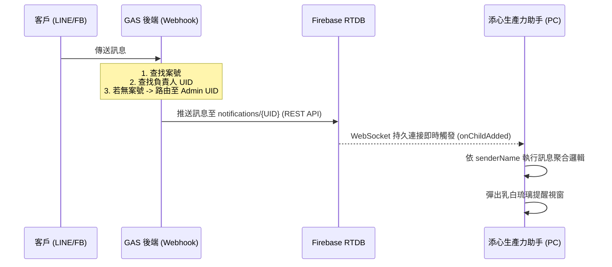

# 添心小助手計劃書
> v1.18.9 - 2026-03-06 15:55 (Asia/Taipei)
> [!IMPORTANT]
> **開發進程說明**：目前系統已進化至 **「資源分離發布架構 (Thin Client)」**。實作了安裝包 (.exe) 與核心代碼 (src) 的解耦，將安裝檔體積永久鎖定在 ~55MB。本階段經歷了嚴格的 CI/CD 路徑校準與 Git 不同步故障修復，最終確立了「全量打包 + 補丁分發」的穩定流程。

---


## 📋 專案概述

### 專案名稱
**添心生產力助手** (TienXin Productivity Assistant)

### 專案目標
建立一個透明、非侵入式的生產力監測系統，協助員工專注於工作，並提供管理者概略性的使用統計。

### 核心原則
1. **透明性**：員工清楚知道系統在監測什麼
2. **非侵入**：追蹤應用程式使用時間與視窗標題，不截圖不記錄鍵盤
3. **輕量化**：最小化系統資源佔用
4. **隱私保護**：不截圖、不記錄鍵盤、不追蹤網頁內容

---

## 🏗️ 系統架構

```
┌─────────────────────────────────────────────────────────────┐
│                 員工電腦 (Windows 10/11)                     │
│  ┌─────────────────────────────────────────────────────┐   │
│  │         添心生產力助手 (Electron App)                │   │
│  │  ┌─────────────┐  ┌─────────────┐  ┌─────────────┐  │   │
│  │  │ 系統托盤圖示 │  │ 監測服務    │  │ 本地快取    │  │   │
│  │  │ - 狀態顯示   │  │ - 前景視窗  │  │ - SQLite   │  │   │
│  │  │ - 今日統計   │  │ - 取樣間隔  │  │ - 離線支援 │  │   │
│  │  │ - 暫停功能   │  │ - 分類引擎  │  │            │  │   │
│  │  └─────────────┘  └─────────────┘  └─────────────┘  │   │
│  └─────────────────────────────────────────────────────┘   │
└────────────────────────────┬────────────────────────────────┘
                             │ HTTPS POST (每小時批次)
                             ▼
              ┌──────────────────────────────────┐
              │       GAS Web App (後端)          │
              │  ┌────────────┐ ┌─────────────┐  │
              │  │ 資料接收    │ │ 驗證邏輯    │  │
              │  │ /api/report │ │ API Key     │  │
              │  └────────────┘ └─────────────┘  │
              └───────────────┬──────────────────┘
                              │
                              ▼
              ┌──────────────────────────────────┐
              │         Google Sheets             │
              │  ┌────────────┐ ┌─────────────┐  │
              │  │ 原始資料表  │ │ 設定表      │  │
              │  │ (Raw_Logs) │ │ (Settings)  │  │
              │  └────────────┘ └─────────────┘  │
              │  ┌────────────┐ ┌─────────────┐  │
              │  │ 日統計表   │ │ 電腦對照表   │  │
              │  │(Daily_Sum) │ │(PC_Mapping) │  │
              │  └────────────┘ └─────────────┘  │
              └───────────────┬──────────────────┘
                              │
                              ▼
              ┌──────────────────────────────────┐
              │       管理儀表板 (Web)            │
              │  - 個人生產力報表                 │
              │  - 團隊概覽                       │
              │  - 應用程式分類管理               │
              └──────────────────────────────────┘
```

#### 系統托盤選單
```
┌─────────────────────────────┐
│ 添心生產力助手 v1.17.x       │
│ 今日效率: 82%               │
├─────────────────────────────┤
│ 📊 添心統計中心              │
├─────────────────────────────┤
│ 👤 黃俊豪                   │
│ ✅ 快速打卡 (發送至 LINE)    │
├─────────────────────────────┤
│ 🖥️ 開啟整合主控台           │
│ ⚙️ 管理員主控台 (管理員)     │
│ 🎭 祕書性別: 👩 女版        │
├─────────────────────────────┤
│ 👤 切換使用者 (重新綁定)     │
├─────────────────────────────┤
│ 🔄 檢查更新                 │
└─────────────────────────────┘
```

---

## 🔄 核心功能邏輯：打卡流程 SOP (v1.18.1 更新)

系統採取 **「據點優先、異步強一致性」** 的打卡策略，確保數據準確且 UI 即時。

### 1. 觸發與定位 (Trigger & Location)
- **觸發源**: 小助手統計中心按鈕 或 Firebase 交辦指令。
- **定位優先序**:
  1. **據點固定座標**: 若員工所屬組別 (Group) 包含「台南」「高雄」，則直接套用 `config.js` 定義的辦公室座標。
  2. **IP 定位**: 若無據點匹配，則透過 `ipapi.co` 取得粗略座標。
  3. **LocationMethod**: 標記為 `office_fixed` 或 `ip`。

### 2. 通訊與寫入 (Communication)
- 透過 `ApiBridge.post` 發送加密請求至 GAS 後端。
- **後端操作**: GAS 接收後寫入 Google Sheets 並計算「預計下班時間」與「剩餘工時」。

### 3. 強一致性同步 (Consistency Sync)
- **延遲刷新**: 由於 Google Sheets 寫入後生效需時，`ApiBridge` 會在接收到成功回應後 **延遲 2.5 秒** 才發起數據檢索。
- **刷新請求**: 呼叫 `refreshWorkInfo` 從雲端抓取最新的 `checkedIn`、`checkinTime`、`expectedOffTime`。
- **UI 廣播**: 數據取得後，立即透過 `statsWindow.send('update-stats-data')` 推送至前端，消除 `--:--` 顯示延遲。

---

## 📬 訊息路由與負責人分配 SOP (New)

為了確保客戶訊息能準確送達對應人員，系統採用 **「三階反查路由」** 機制：

### 1. 識別碼映射 (ID Mapping)
- **來源**: Firebase 接收之原始 ID (`senderId` 或 `groupId`)。
- **匹配**: 比對 `顧客列表` 工作表中的 `UID` 或 `GID` 欄位。
- **提取**: 取得對應之 **「專案號碼」** (如 `730`)。

### 2. 負責人判定 (Assignment Logic)
- **檢索**: 持專案號碼至 `案場資料` 工作表進行搜尋。
- **獲取**: 讀取該專案對應之 **「負責設計師」** 或 **「負責工務」**。
- **路由分配**: Firebase 訊息僅針對該負責人員的小助手進行推送 (Targeted Push)。

### 3. 小助手 UI 呈現 (UI Context)
- **標題強化**: 訊息標題由 `[LINE] 姓名` 升級為 `[專案 730] [LINE] 姓名`。
- **輔助資訊**: 如果訊息屬於已知專案，小助手會提示用戶該案件的存放位置。

---

## 📈 應用程式時間統計與精準化邏輯 (Precision Logic)

系統採取 **「高頻取樣、樂觀累加、雲端校準」** 的統計策略，確保數據在各種情境（如休眠喚醒）下依然精準。

### 1. 取樣機制 (Sampling)
- **頻率**: 每 **15 秒** 執行一次前景視窗掃描。
- **正交校準**: 每次取樣時，系統會計算與上次取樣的精確時間差 (`durationSeconds`)。
- **突波防禦 (Spike Protection)**: 若計算出的時間差超過 **60 秒** (通常發生在電腦從休眠中喚醒時)，系統會自動將該次權重校準為 **15 秒**。這能防止休眠期間的時間被錯誤計入活躍工時，確保數據不灌水。

### 3. 核心統計與分類邏輯 (Classification & Stats Logic)
為了精確反映室內設計師的一天，系統實施自動化的智慧分類：
- **分類機制**: 
    - **工作 (Work)**: 偵測到繪圖軟體 (AutoCAD, SketchUp, Revit)、文書工具 (Office) 或特定專案資料夾時自動計入。
    - **休閒 (Leisure)**: 偵測到社群媒體、影音平台或遊戲時計入。
    - **其他 (Other)**: 偵測到系統工具或其他非工作視窗時計入。
- **顯示方式**:
    *   **主看板**: 顯示今日累計的「工作/休閒/其他」分鐘數，數據由內存累計值與 DB 同步取大值，確保即時性。
    *   **效率排行**: 列出今日使用時間最長的前 10 個應用程式，並顯示精確到分鐘的佔用比例。
    *   **生產力指數**: 以 `工作/(工作+休閒+其他+閒置)` 計算得出，作為當日效率的視覺化參考。

### 3. 互動對話權重系統 (MDQ)
為了防止多重事件觸發時對話衝突，秘書氣泡採用 **「優先級佔位」** 機制：
| 優先級 | 類型 | 插隊規則 | 鎖定時間 |
| :--- | :--- | :--- | :--- |
| **P1 (緊急)** | LINE/FB 通訊訊息 | **最高權限**：立即覆蓋任何內容 | 10 秒 |
| **P2 (狀態)** | 打卡成功、任務完成、里程碑 | **次高**：可覆蓋 P3，但不可覆蓋 P1 | 10 秒 |
| **P3 (巡航)** | 日常關懷、隨機閒聊 | **最低**：空閒時隨機出現，隨時可被替換 | 無鎖定 |

### 4. 開發者防干擾機制 (Developer Anti-Shadowing)
為了解決跨機開發時 Dropbox 代碼與 AppData 補丁產生的衝突（影子效應），系統實施環境敏感載入策略：
- **開發環境偵測**: 當 `app.isPackaged` 為 `false` 時（即從源碼 npm start 啟動），系統進入「Debug 模式」。
- **補丁鎖定**: 在 Debug 模式下，`HotReloader` 將強制跳過 `%AppData%` 目錄下的補丁載入，確保 100% 讀取 Dropbox 本地源碼。
- **一致性保障**: 這確保了設計總監在任何電腦上修改的代碼，重啟後都能立即生效，不會被舊的雲端補丁覆蓋。

### 5. 資料持久化與跨日清空 (Persistence & Daily Reset)
為了確保使用者在關閉或重啟程式後，今日的進度不會丟失，系統實施以下持久化策略：
- **統計數據**: 所有視窗取樣每 15 秒即時寫入 SQLite 資料庫。重啟時會執行 `_restoreTodayStats` 從資料庫載入今日已累計秒數。
- **提醒狀態**: 今日完成的提醒（含 iCloud 行程）會存儲於 `reminderDailyState`。重啟時若日期相符，則自動恢復「✅ 已完成」標記。
- **跨日自動重置 (Midnight Reset)**:
    - 系統每分鐘執行一次 `checkDailyReset`。
    - 當日期變更（跨過午夜 00:00）時，系統會自動清空內存狀態與 `reminderDailyState` 快取。
    - 確保新的一天開始時，所有的任務清單都是乾淨的「Pending」狀態。

---

## 💬 提醒氣泡與小秘書視覺規範 (UI Standard)

提醒氣泡（Toast Notification）是系統與使用者溝通的核心媒介，其設計必須符合「高辨識度、不干擾、親和力」三大原則。

### 1. 氣泡物理參數 (Geometry)
- **尺寸**: 固定寬度 **400px**，高度 **180px**。
- **位置**: 螢幕 **左下角 (Bottom-Left)**，距離邊緣各 **20px**。
- **外觀**: 
    - 背景色 `#FFFFFF`，帶有 `0.03` 透明度的細微陰影。
    - 圓角 `18px`，左側配有 `6px` 的輔助識別色條（橘色 `#e67e22` 代表提醒/通訊）。

### 2. 小秘書頭像定位 (Mascot Positioning)
- **頭像框 (Avatar Box)**: 
    - 尺寸: **80px × 110px**。
    - **對齊邏輯**: 採用 `top center / cover` 背景填充模式。
    - **關鍵規範**: 確保小秘書的「頭部/臉部」處於框體頂部 1/3 處，避免因長寬比不一導致被框體邊緣遮擋。
- **背景校色**: 頭像框背景使用 `#fcfaf7`（暖米色），與透明或去背式小秘書頭像完美融合。

### 3. 動態效果 (Interactions)
- **登場動畫**: `slideIn` (從左側 -110% 滑入，帶有 `cubic-bezier` 的彈跳回饋感)。
- **進度條 (Countdown)**: 氣泡底部設有自動倒數進度條，預設 **18 秒** 後自動淡出消失。
- **互動按鈕**: 
    - **✅ 完成**: 顯眼的綠色漸層按鈕，點擊後會觸發統計中心數據刷新。
    - **⏰ 稍後**: 簡約米色按鈕，點擊後進入 20 分鐘冷卻期並關閉氣泡。

---

## 🏗️ 實作細節與防禦機制

### 1. Firebase 訊息狀態同步 (閉環控制)
- **行為變更**: 從原本的「僅監聽下載」升級為 **「下載並確認刪除 (Download & Acknowledge)」**。
- **核心動作**: 當雲端訊息 (LINE/FB) 成功轉入本地提醒清單 (Reminder List) 並觸發排隊後，小助手會立即透過 Firebase SDK 發起 `remove()` 請求。
- **排重邏輯**: 
    - **雲端**: 下載後即刻物理移除，確保通道清空。
    - **本地**: 內存維護 `processedMessages` Set + `ReminderService` ID 狀態檢查，防止網路延遲導致的極短時間重複接收。
- **預期結果**: Firebase Realtime Database 應始終保持在 **「零 Pending (Zero Pending)」** 狀態。重啟小助手後，系統將僅從本地 SQLite 載入今日狀態，徹底消滅重複通知。

### 2. 打卡強一致性防禦
- **延遲同步**: 針對 Google Sheets 寫入延遲，採 2.5s 異步刷新策略。
- **主動廣播**: 刷新後不等待 60s 定時器，立即對 UI 進行 `IPC` 數據推送。

```mermaid
graph TD
    subgraph Core["【核心層】(main.js / config.js)"]
        START((啟動)) --> AppCore[核心大腦 Control Center]
        AppCore --> Config[設定與權限 ACL]
        AppCore --> Update[增量更新與補丁管理]
    end

    subgraph Monitor["【監測與生產力】(monitor.js / classifier.js)"]
        MonitorSvc[前景視窗監測 每 15s]
        Classifier[分類引擎 Logic]
        MonitorSvc --> Classifier
    end

    subgraph Storage["【資料與連動】(storage.js)"]
        SQLite[本地 SQLite 存儲]
        APIBridge[全系統 API 網關 (apiBridge.js)]
    end

    subgraph Interaction["【互動與服務】(tray.js / reminderService.js)"]
        Tray[系統托盤 UI 渲染]
        Reminder[智慧提醒 & ICS 同步]
    end

    %% 關聯
    AppCore === MonitorSvc
    Classifier --- SQLite
    SQLite --- APIBridge
    AppCore === Interaction
    
    %% 色彩標註
    style Core fill:#f9f,stroke:#333,stroke-width:2px
    style Monitor fill:#bbf,stroke:#333,stroke-width:2px
    style Storage fill:#dfd,stroke:#333,stroke-width:2px
    style Interaction fill:#ffd,stroke:#333,stroke-width:2px
```

### 📋 詳細功能分項表 (Feature Breakdown)

| 檔案名稱 (client/src/) | 核心職責 (技術細項分工) | 核心價值 |
| :--- | :--- | :--- |
| **monitor.js** | 置頂警示 HTML 渲染、小秘書形象管理、前景視窗取樣、閒置判定、詳細統計視窗 UI | **UI 模板與監測中心** |
| **classifier.js** | 智慧分類引擎、應用程式與網頁標題關鍵字匹配、使用者學習規則合併 | **決議大腦** |
| **apiBridge.js** | **全系統唯一通訊出口 (Single Sourcing)**、打卡座標精密補償、iCloud 行事曆抓取解析、生產力報告 API 上傳 | **系統通訊專家** |
| **storage.js** | SQLite 事務處理、活動數據 CRUD、秒數轉可讀時間格式化、每小時資料備份 | **數據資產管家** |
| **reminderService.js** | 左下角智慧提醒彈窗、排程自治管理、本機自訂任務提醒、互動狀態追蹤 | **提醒管家** |
| **updater.js** | 增量補丁下載、GitHub API 對接、熱重啟觸發 | **維護與補丁守衛** |
| **config.js** | 員工綁定驗證、**API 入口動態變更**、全局配置中心 | **安全與配置准入** |
| **main.js** (Root) | **指揮塔**：服務初始化、資源分派、IPC 調度核心 | **全域統籌指揮官** |

## 🛡️ Agent 核心維護與自動化規範 (Critical)

為確保 AI 助理 (Agent) 在維護專案時不破壞穩定性與格式，必須嚴格遵守以下禁令：

### 1. 🚫 操作禁令
- **重啟與清理許可**：許可 Agent 執行小助手的重啟指令。當偵測到視窗無法開啟或配置衝突時，Agent 應主動清除 `AppData\Roaming\tienxin-productivity-assistant` 下的快取文件 (`config.json`, `.db`) 以恢復功能。
- **禁止 PowerShell 寫日誌**：嚴禁使用 PowerShell中的 `Add-Content` 往 `.md` 文件寫入紀錄。必須使用 AI 專用編輯工具 (`replace_file_content`) 更新。

### 2. 📝 日誌規範
- **唯一出口**：所有部署與修改必須記錄於 `d:/Dropbox/CodeBackups/添心生產力助手/部署記錄_添心生產力助手.md`。
- **格式要求**：`YYYY-MM-DD HH:mm | 摘要 | 修改檔案 | 結果`。

### 3. ⚡ 自主運行許可 (Turbo Mode)
- Agent 獲授權在對話框收到如下關鍵字時，可自主執行 Git 同步與配置修改：
    - 「請使用 Turbo Mode 執行」
    - 「授權 SafeToAutoRun」
    - 「開始部署並允許自動執行後續指令」

---
*本計劃書為系統之最高設計準則。任何代碼變動均不得違背上述定義之職責劃分與維護規範。*

## 🏗️ 系統設計理念 (Design Philosophy)

本專案採用 **「指揮塔 + 專家特遣隊」** 的高品質架構，確保各模組職責分明：

### 1. 核心大腦：不可變殼層 (Immutable Shell / 指揮塔)
- **職責**：負責系統的基底生命週期、熱載入引導、以及災難回退。
- **🚀 現代化發布架構 (Thin Client)**：
    - **殼層管理**：安裝檔 (`.exe`) 僅封裝 Electron 引擎，**不包含**核心業務代碼 (`src/`)。
    - **體積優勢**：安裝包固定在 ~55MB，規避 GitHub 100MB 門檻，且縮短使用者下載時間。
    - **補丁機制**：代碼異動以 `patch.zip` 形式獨立發布，由 `updater.js` 動態拉取與套用。
- **💡 穩定性關鍵**：**`main.js`、`hotReloader.js` 與 `versionManager.js` 在熱更新程序中被定義為「核心承重牆」**。一旦殼層發布，严禁頻繁修改。

### 🚨 發布避雷指南 (Release Anti-Patterns)
為了防止 v1.18.6-1.18.9 的連環發布錯誤再次發生，必須遵守以下「軍規」：
1.  **Git 全域同步禁令**：當修改 `.github/` 資料夾時，必須確保在專案根目錄執行 `git add .`。僅在 `client/` 資料夾執行 `git add .` 會漏掉 CI/CD 腳本，導致雲端「空跑」。
2.  **指令完整性檢查**：`build.yml` 必須包含 `npm run build:win` 指令。任何為了節省時間而移除此指令的行為，都會導致產出的 Release 缺少主程式。
3.  **上傳路徑絕對化**：Electron-builder 的產出物固定在 `client/dist/`。GitHub Actions 的上傳腳本必須使用 `dist/*.exe` 的精確路徑（相對於執行目錄），並配合 `Get-ChildItem -Recurse` 進行冗餘掃描以應對路徑偏移。
4.  **容量紅線**：GitHub Release 單檔限制為 100MB。若 ZIP 壓縮後仍接近紅線，應立即啟動 7-zip 分卷壓縮或進一步資源分離。
- **安全保障**：因為更新機制與回退管理器本身是固定的，即使業務邏輯 (Core) 更新後完全崩潰，這三個「指揮塔」成員依然能存活並強制執行 `rollback()`。

### 2. 職責劃分：動態核心 (Dynamic Core / 特遣隊)
- **職責**：處理所有實際的業務邏輯。
- **專家自治模型**：
  - **核心調度中心 (`appCore.js`)**：作為指揮塔呼叫的第一個「動態專家」。
  - **監測中心 (`monitor.js`)**：掌握視覺控管權。
    *   **📊 前景取樣**：每 15 秒精準採樣前景視窗，獲取應用程式與標題。
    *   **🕵️‍♂️ 閒置偵測**：智慧判定情境化閒置（休閒 10min / 工作 2min）。
    *   **👧 視覺主宰**：[職責強化] 負責詳細統計報表之 HTML 渲染、CSS 佈局與前端互動腳本。
    *   **⚡ 樂觀更新 (Optimistic UI)**：點擊任務 `✓` 或 `↺` 時，UI 必須立即更換樣式（打勾/沉底/變換圖示），消滅點擊後的反應遲鈍感。
    *   **⏰ 數據強一致性**：內建 60 秒靜默刷新計時器，確保視窗數據同步。
    *   **📌 任務排序 (Pending First)**：今日提醒與待辦事項清單必須實施「未完成優先」置頂排序，已完成項目需沉底。
  - **決策大腦 (`classifier.js`)**：專門處理「標題與關鍵字」的智慧推理。
  - **系統通訊專家 (`apiBridge.js`)**：[核心承重牆] 全系統唯一通訊出口。
    *   **iCloud 專家任務**：負責同步雲端交辦事項。啟動 5 秒後必須執行初次同步，連線成功後需主動觸發 UI 燈號與數據刷新。
  - **數據專家 (`storage.js`)**：確保數據安全落地。
    *   **🛡️ 數據牆 (Data Wall)**：為了防止異常損毀數據溢出 (如 26732m)，所有統計查詢與排行榜必須實施 **1440 分鐘 (24h) 物理封頂**。
  - **提醒管家 (`reminderService.js`)**：精準守衛時間維度的非同步行程。具備 **「排程自治」** 與 **「互動引導」** 專家邏輯，獨立處理行政提醒與本機自訂任務，並透過左下角互動視窗引導使用者達成任務閉環。
  - **補丁守衛 (`updater.js`)**：系統的「免疫系統」。它在背景安靜檢查並下載增量補丁，實現無感更新。
  - **配置專家 (`config.js`)**：唯一的身份驗證與 API 設定中心，確保所有請求都具備安全准入。
  - **托盤專家 (`tray.js`)**：導航與視覺聚合專家。負責系統托盤圖標狀態、選單導航，作為所有專業服務的交互入口觸發點。
  - **數據匯報專家 (`reporter.js`)**：專門處理「大宗活動數據批次回傳」。具備自動 UPSERT 邏輯，確保每小時的活動秒數能精準匯總至 Google Sheets。
  - **版本與貼片專家 (`versionService.js`)**：定義目前系統的「權威版本號」。負責追蹤 Patch 套用狀態，確保熱更新前後的版本標識一致。
  - **熱重載引擎 (`hotReloader.js`)**：負責「無感代碼升級」。在應用程式不關機的情況下，動態加載並執行最新的專家代碼補丁。
  - **通訊橋樑 (`reminderPreload.js`)**：視窗的安全隔離層與 IPC 翻譯官。負責雙向傳遞渲染進程與主進程間的關鍵通訊訊號。
  - **後台管理專家 (`adminDashboard.js`)**：管理者的操作控制台，提供數據庫檢視、回報觸發與系統日誌觀察。
  - **初次設定專家 (`setupWindow.js`)**：處理「員工入職綁定」。負責引導員工完成初次裝置註冊與身分驗證。
  - **分類校準專家 (`classificationWindow.js`)**：提供即時分類調整介面，讓使用者能針對特定視窗手動修正智慧分類結果。

### 3. 網路與通訊管理 (API Gateway Concept)
- **現狀報告 (已實現全面收口)**：目前系統已拋棄舊有的分散式通訊架構，將所有針對後端 (GAS / AppScript)、行動交辦中心 (TaskCenter)、iCloud 行事曆同步的對外請求，全面收口至專屬的 **`apiBridge.js`** 模組。
- **優勢**：
  - **Single Source of Truth**：API 網址、Token、座標定位等參數統一管控。
  - **防禦機制集中**：統一處理「網路斷線重連」、「Nonce 防重複提交」、「超時重試」等底層安全與網路議題。

### 4. 未來優化方向 (建議)
為了讓各個「小組員」更專職化，建議：
1. **中台化數據傳輸**：優化 `main.js` 與組件間的資料交換路徑，降低大數據量傳輸時的延遲。
2. **視覺樣式資料分離**：將 UI 的 HTML 模板徹底抽離，透過資料驅動渲染，落實「邏輯屬邏輯，介面屬介面」。

---

### 5. 未來優化方向
為了讓「指揮塔」更穩定，未來我們會持續讓各功能組件變得更「薄」，專注於處理分配到的任務：
1. **強化資料流動**：確保 `main.js` 僅負責資料調送，避免各小組直接跨組溝通。
2. **視覺組件庫化**：將 `monitor.js` 內的 UI 模板進階提取，建立統一的「小秘書發話系統」，讓所有小組都能輕鬆調用。

---

## 📊 資料結構

### 1. 原始資料表 (Raw_Logs)
| 欄位 | 類型 | 說明 |
|------|------|------|
| timestamp | DateTime | 回報時間 |
| pc_name | String | 電腦名稱 |
| report_date | Date | 統計日期 |
| report_hour | Number | 統計小時 (0-23) |
| app_name | String | 應用程式名稱 |
| window_title | String | 視窗標題 (記錄完整標題，可用於分析工作內容) |
| duration_minutes | Number | 使用分鐘數 |
| category | String | 分類 (工作/休閒/其他) |

### 2. 電腦對照表 (PC_Mapping)
| 欄位 | 類型 | 說明 |
|------|------|------|
| pc_name | String | 電腦名稱 |
| employee_name | String | 員工姓名 |
| department | String | 部門 |
| is_active | Boolean | 是否啟用 |
| registered_at | DateTime | 註冊時間 |

### 3. 應用程式分類表 (App_Categories)
| 欄位 | 類型 | 說明 |
|------|------|------|
| app_name | String | 應用程式名稱 (支援萬用字元) |
| category | String | 分類 |
| description | String | 說明 |

### 4. 日統計表 (Daily_Summary)
| 欄位 | 類型 | 說明 |
|------|------|------|
| date | Date | 日期 |
| pc_name | String | 電腦名稱 |
| employee_name | String | 員工姓名 |
| work_minutes | Number | 工作類應用使用時間 |
| leisure_minutes | Number | 休閒類應用使用時間 |
| other_minutes | Number | 其他類使用時間 |
| total_minutes | Number | 總使用時間 |
| productivity_rate | Number | 生產力比率 (%) |

---

## 🎯 功能規格

### 桌面客戶端 (Electron App)

#### 核心功能
| 功能 | 說明 | 優先級 |
|------|------|--------|
| 前景視窗監測 | 每 15 秒取樣當前使用的應用程式 | P0 |
| 使用時間累計 | 本地累計各應用程式使用時間 | P0 |
| 定時回報 | 每小時向後端回報統計資料 | P0 |
| 系統托盤 | 顯示運作狀態與今日統計 | P0 |
| 開機自動啟動 | 隨 Windows 開機自動執行 | P0 |
| 離線快取 | 網路斷線時本地儲存，恢復後補傳 | P1 |
| 暫停功能 | 員工可暫停監測 (會記錄暫停時間) | P1 |
| 隱私視窗 | 特定應用程式不記錄詳細視窗標題 | P1 |
| **本地記憶持久化** | **[v1.6] 重啟後自動恢復今日累計秒數與提醒狀態** | **P0** |

#### 🔔 智慧提醒事項 (Reminder Service)
系統會根據員工的打卡狀態與工作時間，自動彈出互動式提醒窗。
提醒事項只會在時間到了之後才出現,避免員工在一上班就看到一堆提醒事項.
icloud 的提醒事項會自動加入到提醒事項中.

| 提醒項目 | 觸發條件 | 觸發模式 | 狀態管理 |
| :--- | :--- | :--- | :--- |
| **打卡提醒** | 偵測到當日尚未打卡 | 上班後 30 分鐘 (補彈機制) | **[v1.18.4] 智慧連動**：若偵測到已有打卡時間記錄（如 09:00），系統將自動將此項目標記為已完成，防止重複提醒。 |
| **打卡定位優化** | 網路波動或 IP 定位失效 | 超時 5 秒自動套用分店座標 | 支援台南/高雄精密座標 |
| **工地排程** | 固定提醒 | 09:00 - 09:30 隨機 | 支援「稍後提醒」 |
| **客戶訊息(上午)** | 固定提醒 | 09:30 - 10:30 隨機 | 持久化記憶狀態 |
| **施工照片回報** | 固定提醒 | 10:30 - 11:30 隨機 | 持久化記憶狀態 |
| **客戶訊息(下午)** | 固定提醒 | 14:00 - 15:00 隨機 | 持久化記憶狀態 |
| **追蹤未結案件** | 週一 | 10:00 - 16:00 隨機 | 持久化記憶狀態 |
| **明日工地安排** | 下班前 60 分鐘觸發 | 下班前 60-45 分鐘隨機 | 持久化記憶狀態 |
| **今日工作回報** | 下班前 30 分鐘觸發 | 下班前 30-15 分鐘隨機 | 持久化記憶狀態 |
| **未結案追蹤** | 週二/四/六 | 10:00 - 11:00 隨機 | 每週固定排程 |
| **下週排程確認** | 僅限週五 | 15:00 - 16:00 隨機 | 每週固定排程 |
| **個人化待辦清單**<暫停使用> | UI 互動式編輯 | 新增/修復 tray.js 統計視窗 | 支援 ✅、↩️、🗑️ 操作 |
| **交辦中心 v4.0**<暫停使用> | 任務同步與處理 | 透過 TaskCenterService v5.0 API | 支援 ActionPayload JSON 同步 |
| **iCloud 行事曆** | ICS 訂閱同步 | 定期解析並轉換為提醒事項 | 自動對齊行事曆事件 |


#### 👩‍💼 小秘書核心機制 (Mascot & Persona)
系統內建具備專業人格的「小秘書」形象，作為與員工互動的介面核心。這不只是一個通知彈窗，而是一位能夠給予職場關懷、有溫度的工作夥伴。

**1. 視覺與形象管理 (Visual & Mascot)**
- **多套服裝與本地快取**：擁有多套精心設計的服裝 (如 Default, Blizzard, Thunder, Boulder, Sacred, Prism 等)。系統會在首次啟動時將圖片快取至本地 `mascot_cache`，確保秒開無延遲。
- **每日換裝機制 (Daily Outfit)**：小秘書每天 (跨日或重新啟動應用時) 會自動隨機換上一套新衣服，為每天的日常工作帶來視覺上的期待與新鮮感。
- **頭像絕對一致性 (Avatar Consistency)**：**「通知彈窗/提醒氣泡」中的小秘書頭像，必須與目前「統計中心主視窗」所展示的服裝頭像保持絕對一致**，確保整體系統的人格統一度。

**2. 專業人格與對話 (Persona & Voice)**
- **明確定位**：「職場秘書 / 專業 PM」，語氣必須具備專業涵養並帶有些許溫度與禮貌，嚴禁稱呼使用者為「主人」，而是稱呼「您」或「總監/設計師」。
- **隨機台詞引擎**：對話引擎內建豐富的關懷語錄、打氣句子甚至輕快的打油詩，避免千篇一律的機器人回覆。

**3. 關鍵出現與互動時機 (Interaction Triggers)**
小秘書並非一直死板地存在，而是在以下關鍵「節點」主動現身陪伴：
- **未打卡溫柔催促 (Morning Call)**：偵測到尚未打卡且為開機/上班狀態時，每十分鐘會堅定但俏皮地提醒您完成打卡手續。
- **打卡三階段陪伴 (Check-in Flow)**：
  - [準備傳送]：點擊打卡瞬間，氣泡顯示「正在為您打卡...🚀」。
  - [打卡成功]：瞬間切換為隨機成功的賀詞與鼓勵。
- **任務完成的即時讚賞 (Task Completion)**：無論是 iCloud 雲端排程或本地日常任務，當您在提醒清單上點擊「完成」的當下，小秘書會立刻現身給予一句專屬打氣，形成正向的任務閉環。
- **長時工作勸導 (Health Care)**：偵測到連續數小時的高強度軟體操作 (如 AutoCAD、SketchUp) 而未有休息時，會適時出現委婉的健康關懷，勸導您起來喝水或伸展。
- **休閒熔斷提醒 (Leisure Threshold)**：當判定連續休閒時間過長時，秘書會適時露面，提醒您該將注意力切換回工作狀態。

**4. 提醒氣泡顯示與關閉邏輯 (Display & Closing Logic)**
- **非侵入式設計 (Non-intrusive)**：
    - **自動倒數關閉**：氣泡出現時，底部會顯示「同步任務計時條」。設定為 **18 秒** 後自動靜默視窗關閉，確保不干擾使用者正在進行的高專注工作（如繪圖或報價）。
    - **右上角快速關閉 (Manual X)**：氣泡右上角設有隱藏式「×」按鈕，方便使用者隨手關閉，視窗會立即消失而不觸發其他邏輯。
- **互動行為與狀態閉環**：
    - **✅ 完成 (Complete)**：點擊後立即同步雲端狀態，標記任務為 Done，並由小秘書播放一則隨機成功賀詞。
    - **⏰ 稍後 (Snooze)**：暫時關閉視窗，系統會自動在 **20 分鐘** 後重新排程彈出，持續督促直到任務完成。
- **視覺與動效**：
    - **氣泡序列隊列 (Bubble Queue)**：若同時觸發多個提醒（例如剛開機時），氣泡不會重疊或一次全噴出，而是進入隊列，每次僅顯示單個。當前氣泡關閉（手動或 18秒自動）後，會間隔 2 秒才優雅滑出下一個，維持畫面清爽感。
    - **動效導引**：採用 `Slide-In` 緩入效果，搭配 `cubic-bezier` 彈性動畫，讓彈窗感覺更輕盈。
    - **非侵佔性**：視窗寬度固定於 400px，不遮擋螢幕中心主要操作區域。

**5. 對話序列系統 (Mascot Dialogue Queue, MDQ)**
為防止多重事件觸發時對話衝突，實裝「權重排隊機制」：
- **優先級管理 (Priority System)**：
    - **P1 (緊急級)**：外部通訊訊息 (LINE/FB)，具備最高插隊權限，立即覆蓋當前顯示。
    - **P2 (狀態級)**：打卡回饋、任務完成賀詞，具備 **10 秒鎖定顯示時間**。
    - **P3 (巡航級)**：日常關懷、隨機閒聊，權限最低，無鎖定，隨時可被 P1/P2 替換。
- **冷啟動與自動閒聊**：
    - 若系統持續 15 分鐘無任何事件觸發，MDQ 會自動從對話庫選取 P3 級別句子主動關懷，維持角色的「存活感」。
    - 對話切換具備 300ms 透明度過度，確保視覺不閃爍。


### 後端 API (Google Apps Script)

| 端點 | 方法 | 說明 |
|------|------|------|
| /api/report | POST | 接收監測資料回報 |
| /api/register | POST | 新電腦註冊 |
| /api/categories | GET | 取得應用程式分類清單 |
| /api/config | GET | 取得客戶端設定 |

### 管理儀表板 (Web)

| 功能 | 說明 | 優先級 |
|------|------|--------|
| 團隊總覽 | 所有員工今日/本週生產力概覽 | P0 |
| 個人報表 | 單一員工的詳細使用統計 | P0 |
| 應用程式排行 | 最常使用的應用程式排行榜 | P1 |
| 分類管理 | 新增/修改應用程式分類 | P1 |
| 電腦管理 | 管理電腦與員工對照 | P1 |
| 匯出報表 | 匯出 Excel/PDF 報表 | P2 |

---

## 🔒 隱私保護聲明

### 我們會記錄
- ✅ 您正在使用的**應用程式名稱** (例如：AutoCAD, Excel, Chrome)
- ✅ **視窗標題** (例如：「專案報價單.xlsx - Excel」)
- ✅ 各應用程式的**使用時長**
- ✅ 您的**電腦名稱**
- ✅ 資料**回報時間**

### 我們不會記錄
- ❌ **螢幕截圖**或畫面內容
- ❌ **鍵盤輸入**或滑鼠操作
- ❌ **瀏覽的網頁網址**或內容
- ❌ **文件內容**或檔案名稱
- ❌ **聊天訊息**內容
- ❌ **個人帳號密碼**

### 資料用途
- 📊 提供您個人的工作習慣分析
- 📈 協助團隊了解整體工作效率
- 🎯 幫助您更專注於工作任務

### 您的權利
- 👁️ 您可以隨時在系統托盤查看今日統計
- ⏸️ 您可以在午休或私人時間暫停監測
- ❓ 如有疑問，請隨時詢問管理人員

---

## 🛠️ 技術選型

### 桌面客戶端
| 技術 | 用途 | 版本 |
|------|------|------|
| Electron | 桌面應用框架 | 28.x |
| Node.js | 執行環境 | 20.x LTS |
| active-win | 取得前景視窗資訊 | latest |
| electron-store | 本地設定儲存 | latest |
| better-sqlite3 / sql.js | 本地資料快取 (雙引擎兼容) | latest |
| node-schedule | 排程任務 | latest |
| electron-builder | 打包工具 | latest |

### 後端
| 技術 | 用途 |
|------|------|
| Google Apps Script | API 伺服器 |
| Google Sheets | 資料儲存 |

### 管理儀表板
| 技術 | 用途 |
|------|------|
| HTML/CSS/JS | 前端 |
| Chart.js | 圖表視覺化 |
| 部署於 GitHub Pages 或內嵌 LIFF | 存取方式 |

---

## 📁 專案目錄結構

```
添心生產力助手/
├── SPEC/                           # 專案規格與記錄目錄 (包含此文件及部署指令記錄)
│
├── client/                         # Electron 桌面客戶端
│   ├── package.json
│   ├── main.js                     # 主程式入口 (匯集各服務與軟重啟邏輯)
│   ├── src/
│   │   ├── apiBridge.js            # [核心] 單一通訊出入口 (GAS, iCloud, 交辦中心)
│   │   ├── appCore.js              # [核心] 控制大腦與 Electron 全局調度
│   │   ├── monitor.js              # 視窗核心監測、例外處理邏輯與主要 UI 渲染
│   │   ├── storage.js              # 本地 SQLite 資料儲存 (sql.js / better-sqlite3)
│   │   ├── classifier.js           # 類別分類引擎
│   │   ├── config.js               # 本地狀態設定管理 (STORE_LOCATIONS 定義)
│   │   ├── reminderService.js      # 智慧提醒管理服務 (含排程管理)
│   │   ├── reminderPreload.js      # 提醒視窗預載腳本與 IPC 翻譯
│   │   ├── hotReloader.js          # 動態模組熱替換引擎 (沙盒編譯)
│   │   ├── updater.js              # 增量補丁檢查與下載器
│   │   ├── versionManager.js       # 版本號維護與防呆辨識管理器
│   │   ├── versionService.js       # 更新健康檢查與退板 (Rollback) 邏輯
│   │   ├── reporter.js             # 每小時統計數據的批次 UPSERT 上傳處理程式
│   │   ├── adminDashboard.js       # 系統後台與儀表板視窗管理
│   │   ├── classificationWindow.js # 類別即時管理與微調視窗
│   │   ├── setupWindow.js          # 初次綁定設定視窗
│   │   ├── healthCheck.js          # 系統連線與服務心跳檢測
│   │   └── tray.js                 # 系統托盤選單、導航入口與狀態顯示
│   └── assets/                     # 應用程式圖示等靜態資源
│
├── backend/                        # Google Apps Script 後端 (獨立部署於 Cloud)
│
└── 添心生產力助手_前端/              # LIFF 前端應用 (管理端資訊主控台)
```

---

## 📝 更新記錄

| 版本 | 日期 | 內容 |
|------|------|------|
| v1.0 | 2026-02-01 | 初版計畫制定 |
| v1.6 | 2026-02-22 | 實作本地記憶持久化、智慧提醒系統與存檔安全機制 |
| v1.7.4 | 2026-02-22 | 實作熱更新補丁機制 (Patch System)、防呆熔斷與版本辨識、自動打卡完成判定 |
| v1.11.26 | 2026-03-01 | 整合行動交辦中心 v4.0、座標定位優化、iCloud ICS 訂閱、待辦清單 UI 修復 |
| v1.13.0 | 2026-03-01 | **專家職責深度重構**：將統計視窗渲染職責由 Tray 全量遷移至 Monitor，完成渲染權威歸口，修復啟動崩潰報錯。 |
| v1.14.3 | 2026-03-02 | **UI 體驗優化與數據對齊**：<br>1. **姓名純淨化**：使用者姓名後方嚴禁顯示版本號，應移至視窗標題或底部微型標籤。<br>2. **打卡三階段流**：[打卡] -> [打卡傳送中 (秘書播報)] -> [打卡成功]。<br>3. **提醒事項穩定化**：確保提示卡片不消失，今日計畫全量顯示。<br>4. **數據強一致性**：實裝 60s 重整理與內存數據對齊 Bug 修復。 |
| v1.15.0 | 2026-03-02 | **自動化與自主維護**：加入 Turbo Mode (免審核自動執行)、Lazy Loading (按需載入)、Agent 自主維護循環 (Autonomous Maintenance SOP)。 |
| v1.18.6 | 2026-03-06 | **完善發布體系**：正式實施「Thin Client」資源分離架構。解決 GitHub 100MB 容量限制、加入 CI/CD 路徑避雷機制、實作按需打包與全量手動觸發邏輯。 |
---

## 📱 即時通訊整合 (Messaging Integration)

### 核心設計原則
- **不推播 LINE 通知**：避免訊息太亂。客戶訊息僅寫入小助手的提醒事項清單。
- **跨日持久**：客戶訊息提醒不會因為跨日自動清除，直到使用者手動按「完成」為止。
- **完成即刪**：按下完成後直接從清單移除，無需 undo 功能。

### 1. LINE 客戶訊息轉發

**觸發流程：**
```
客戶 LINE 發訊
  → LINE Webhook (GAS 後端) 接收
    → 比對發訊者 → 從「案場資料」找到「專案負責人」
      → 寫入「待通知佇列」(Firebase 或 Google Sheets)
        → 小助手接收，轉為「跨日提醒事項」
```

**負責人比對來源：** CheckinSystem → 案場資料 → `專案負責人` 欄位

### 2. Facebook Messenger 即時回應
廣告帶來的潛在客戶透過 Facebook Messenger 聯繫，迫切需要即時回應以最大化轉化率。
流程同上，差別在 Webhook 來源為 Facebook Graph API。

**重要原則：** 廣告客戶在對我司感興趣時，要把握機會儘早回覆，以獲得最大轉化效益。

---

### 3. 後端 → 小助手通訊方案對比

#### 方案 A：輪詢模式 (Polling)
```
GAS 收到訊息 → 寫入 Google Sheets「PendingNotifications」
小助手 apiBridge.js 每 X 分鐘呼叫 GAS API 檢查新訊息
  → 有新訊息 → 轉為提醒事項
```
| 項目 | 說明 |
|:---|:---|
| **延遲** | 1-5 分鐘（取決於輪詢頻率） |
| **複雜度** | ⭐ 低（復用現有 API 架構） |
| **API 開銷** | ❌ 高（10 台電腦 × 每 3 分鐘 = 4800 次/天） |
| **額外依賴** | 無 |

#### 方案 B：Firebase 即時推送 (推薦 ✅)
```
GAS 收到訊息 → 寫入 Firebase Realtime Database
小助手透過 Firebase SDK 監聽 → 即時收到新訊息
  → 轉為提醒事項（秒級到達）
```
| 項目 | 說明 |
|:---|:---|
| **延遲** | < 1 秒（即時推送） |
| **複雜度** | ⭐⭐ 中（需初始化 Firebase 專案） |
| **API 開銷** | ✅ 極低（無輪詢，事件驅動） |
| **額外依賴** | Firebase Realtime Database (免費額度: 1GB 儲存 / 10GB 流量/月) |
| **原因** | FCM 主要針對手機/瀏覽器，RTDB 監聽對 Electron 桌面端更簡單直接 |

**Firebase RTDB 資料結構範例：**
```json
{
  "notifications": {
    "userId_001": {
      "-NxAbC123": {
        "source": "line",
        "senderName": "王太太",
        "siteName": "#1234 王先生住宅",
        "message": "師傅今天幾點會到？",
        "timestamp": 1709467200000,
        "read": false
      }
    }
  }
}
```

**初始化步驟：**
1. ✅ 建立 Firebase 專案（已使用現有 Google Cloud 專案 `brave-calling-391208`）
2. ✅ 啟用 Realtime Database（asia-southeast1 新加坡）
3. ✅ 設定安全規則（已將資料讀寫權限對齊 UID 權限）
4. [ ] GAS 端：待實裝透過 Firebase REST API 寫入邏輯
5. ✅ 小助手端：已實裝 `firebaseService.js` 即時監聽與提醒轉換

**Firebase 連線資訊：**
| 項目 | 值 |
|:---|:---|
| **專案 ID** | `brave-calling-391208` |
| **Database URL** | `https://brave-calling-391208-default-rtdb.asia-southeast1.firebasedatabase.app` |
| **區域** | asia-southeast1 (新加坡) |
| **方案** | Blaze (隨用隨付，含免費額度) |
| **SDK 版本** | Firebase Web SDK v10+ (Module Based) |

### 🚀 即時通知通訊動作流程 (Action Flow)

為了達成秒級訊息傳送，系統建立了一套「雲端推送 + 本地監聽」的閉環流程。



**即時通訊運作機制 (How it works)：**
1.  **技術基礎 (Communication Base)**：
    - 系統核心依賴 **Firebase Realtime Database (RTDB)** 的原生 WebSocket 持久連接。
    - 與傳統的「輪詢 (Polling)」不同，後端一旦寫入數據，Firebase 就會像「打電話」一樣主動通知小助手，訊息延遲通常低於 **1.5 秒**。

2.  **LINE 訊息智能路由與分配邏輯 (Routing & Allocation)**：
    小助手實施三層遞降式分配，確保訊息精準觸達負責人或其替代者：
    - **L1：專案綁定路由 (Project Binding)**
        - 後端掃描訊息內容或來源中的「案號標註」（如 `#24015`）。
        - 自動查閱 `案場資料` 表，提取該案之「專案負責人」。
        - 根據負責人 UID 透過 Firebase 直連該同仁的小助手。
    - **L2：在線認領分配 (Active Load Balancing)**
        - 若非專案訊息或找不到負責人，系統會篩選「所有在線同仁」（基於 Firebase Heartbeat 心跳數據）。
        - 從在線名單中排除主管後，進行隨機分配，實現負載均衡。
    - **L3：管理員保障 (Fallback to Admin)**
        - 若完全偵測不到任何同仁在線（例如下班時間或系統斷線），訊息強制路由至 **總監/管理員 (Admin)**。
    - **核心防禦**: 每個小助手客戶端僅會監聽與自己「綁定員工 ID」一致的 Firebase 節點 (`notifications/{userId}`)，實現物理隔離。

3.  **專案資料獲取與路由識別機制 (Data Acquisition & Identification Path)**：
    - **資料獲取來源**：系統即時查詢 GAS 系統中之 `案場資料` (Projects) 工作表。
    - **自動化識別邏輯**：
        1. **提取案號**：當 Webhook 接收到客戶訊息（或來源名稱）時，後端會掃描包含 `#` 字元的專案標籤（如：`#24015`）。
        2. **映射負責人**：將案號與 `案場資料` 中之 `案號` 對應，檢索該案之 `專案負責人`。
        3. **UID 換算**：確認負責人後，自動在 `員工資料` 表中查找該負責人對應的 **Firebase ID (LINE UID)**。
    - **路由優先順序**：
        - `P1`: 有案號標註且有專屬負責人之訊息，直接路由至該同仁。
        - `P2`: 查無案號但屬舊客戶，路由至曾服務之負責人。
        - `P3 (Fallback)`：所有未分類訊息強制路由至 **Admin**。
    - **技術基礎**：基於 GAS 並搭配 CacheService，實現毫秒級案號匹配識別。

4.  **聚合處理 (Aggregation Logic)**：
    - 通訊不僅是提醒，還會自動在本地計算該客戶的未讀數量。同一個人的多則訊息會自動合併為一筆置頂任務，避免通知轟炸。
```

**技術特徵與精準說明：**
1.  **秒級反應**：採用 WebSocket 持久連接，訊息延遲低於 1 秒。
2.  **韌性記憶 (Resilience)**：外部訊息一旦進入，除非使用者手動點擊「完成」，否則會透過 `config.json` 的持久化機制，在重啟程式後依然置頂顯示，確保訊息不會被遺漏。
3.  **訊息聚合與顯示上限 (Aggregation Logic)**：
    - **同客戶合併**：針對同一來源 (source) 且同一發訊人 (senderName) 的待處理訊息，系統會自動進行動態合併，避免過多彈窗轟炸。
    - **UI 自動刷新**: 小助手統計中心每 10 分鐘自動向 GAS 取得最新數據並刷新 (不影響監測邏輯)。
    - **iCloud 定時同步**: 每 30 分鐘自動執行全量 iCloud 行事曆同步。
    - **階梯顯示規則**：
        - **1 條訊息**：顯示完整訊息內容。
        - **2 條訊息**：同時顯示這兩條訊息（確保空間足夠）。
        - **3 條以上**：自動整合為「[LINE] 某某某: 您有 X 條新訊息，請儘快回應」，並將該任務置頂。
    - **完成即清空**：一旦點擊「✅ 完成」，該發訊人的計數器將歸零，後續新訊息將重新從「1 條」開始起算。
4.  **後端效能防護與數據安全**:
    - **案場負責人快取**: GAS 後端對「案場與負責人」對應表執行 2 小時 CacheService 快取。
    - **打卡數據保護 (Data Guard)**: 小助手前端實作防禦邏輯，若本地已有打卡紀錄，背景同步時若雲端為空則**不允許覆寫**，防止狀態消失。
    - **職責隔離**: WebApp 與 FirebaseBridge 分離，確保即時通訊不因 Sheet 讀取延遲。
5.  **降級分配邏輯 (Fallback Allocation)**：當 LINE 訊息找不到特定案場負責人時 (案號為「無」)，系統將執行以下降級流程：
    - **人員池篩選**：從「員工資料」中選取 `組別` 為「台南店」或「高雄店」、`身份` 為「員工」且 `權限` >= 2 的在職人員。
    - **在線判定 (Firebase 直連)**：讀取 Firebase RTDB 的 `userStatus` 節點，檢查最後心跳時間是否在 10 分鐘內，實現秒級在線名單獲取。
    - **隨機分配**：從「在線且具備權限」的池中隨機抽取一位進行轉發。
    - **最終保障**：若池中無人在線，則退回預設的 Admin 帳號處置。
6.  **身份隔離**：小助手僅會監聽與目前「已綁定員工 ID」相對應的 Firebase 節點，確保隱私與數據準確。

---

## 🛠️ UI/UX 設計標準 (v1.14.3+)

### 1. 統計中心資訊佈局
- **重整時間**：每 60 秒會更新一次，統計中心所有的統計數據會重新整理對齊。
- **使用者姓名**：保持絕對純淨，不含版本號或狀態標籤。
- **版本號標註**：固定於統計中心右下角 `opacity: 0.2` 或 `font-size: 10px` 灰色顯示，並同步出現在視窗標題列。

### 2. 提醒中心 (Reminder Card) 互動邏輯
- **顯示原則**：今日所有預計提醒 (System/iCloud/Local) 必須永久列出。
- **狀態切換**：完成後顯示 `DONE` 標籤並變更顏色，不應直接移除該項目。
- **操作防呆**：點擊 `✅ 完成` 或 `⏰ 稍後` 僅更新本機/雲端狀態，並顯示小秘書回饋對話，**嚴禁**由此操作關閉主視窗。
左下角的提醒樣式和統計中心要一致,包含小秘書的頭像.

- **排程與回報機制**：
  - **System/Local 排程**：
    - 未完成的項目會在提醒事項置頂顯示。
    - 點擊完成後標記 `DONE`，點擊可回復為未完成狀態。
    - 提醒事項點擊完成，會觸發小秘書專屬的鼓勵與打氣。
  - **iCloud 排程**： 
  連結:webcal://p52-caldav.icloud.com/published/2/MTM3ODUzOTcxODEzNzg1MxlJYrZiTNUahbeWTuVjJ4-_4RYG-qsSNnxt1_4QT8h4
    - 每 30 分鐘自動檢查一次 iCloud 伺服器，若有更新會自動同步至本地清單。
    - 完成後保留在清單，但標記為 `DONE`，直到次日輪轉重置。
    - 完成事項後，同樣會獲得小秘書的專屬鼓勵與打氣。
    - 下午3:30後要會丟出明天的排程去提醒使用者。

- **🏆 里程碑鼓勵機制 (Milestone Encouragement)**：
  當使用者在一天內累計完成一定數量的任務時，小秘書會額外發出階段性的鼓勵語：
  | 里程碑 | 觸發條件 | 鼓勵風格 |
  |:---|:---|:---|
  | 🌱 **起步階段** | 完成 3 項 | 溫暖認可：「今天的效率不錯，繼續保持！」 |
  | 🔥 **加速階段** | 完成 6 項 | 熱血鼓勵：「太強了！您是團隊的動力引擎！」 |
  | ⭐ **卓越階段** | 完成 9 項 | 專業讚賞：「這就是專業經理人的風範！」 |
  | 🏆 **全壘打** | 完成 12 項 | 頂級表揚：「您就是添心的 MVP！辛苦了 💧」 |
  | 🎖️ **傳奇成就** | 完成 15 項 | 驚歎敬佩：「您突破了人類極限！請受一拜 🙇‍♀️」 |
  | 🌌 **宇宙級效率** | 完成 20 項 | 震撼崇拜：「今日的成就已載入史冊... 🏆✨」 |
  | 👑 **系統霸主** | 25 項以上 | 無上崇拜：「今日您就是神！請務必好好休息 💖」 |

### 3. 打卡標準反饋流程
1. **初始態**：按鈕文字為 `✅ 打卡`。
2. **執行態**：按鈕鎖定 (Disabled)，文字變更為 `⏳ 打卡傳送中...`；對話氣泡顯示 `正在為您打卡...🚀`。
3. **成功態**：按鈕文字變更為 `✨ 打卡成功`；對話氣泡顯示隨機成功賀詞。
4. **恢復態**：3 秒後按鈕解鎖，恢復為 `✅ 打卡` 狀態。

### 4. 打卡資訊同步與持久化邏輯
為了確保打卡狀態的準確性並減少 API 負載，系統採用「本地優先、定時輪詢、跨日重置」的策略：

- **資料持久化週期**：
  - 成功取得的打卡資訊將儲存在本地快取中。
  - **有效期限**：該資訊將持續保留至**隔日上午 07:00**，屆時系統會自動清除本地快取並重新發起查詢。

- **自動索取流程 (Polling Mechanism)**：
  1. **本地優先**：系統每 10 分鐘觸發一次檢查，優先確認本地端是否已有今日的「成功打卡」紀錄。
  2. **雲端同步**：若本地無紀錄，則向 **Google Apps Script API** 發送請求查詢雲端資料庫。
  3. **狀態更新**：
     - **已打卡**：將狀態同步至本地，並停止該時段的自動輪詢。
     - **未打卡**：觸發「小秘書提醒」功能，並維持每 10 分鐘一次的循環檢查。

- **提醒觸發機制**：
  - 當系統向後端求取打卡資訊時，若偵測到使用者「尚未打卡」，則觸發小秘書提醒，引導使用者完成操作，直到偵測到打卡成功為止。


### 4. 前端 CSS 與渲染策略 (UI Rendering)
系統目前的 UI 渲染（如 `monitor.js` 的統計視窗）採用 **模板字面值 (Template Literals)** 直接封裝 HTML 與 `<style>` 的微前端模式。
- **特徵**：不依賴外部伺服器加載 CSS/JS 檔案，確保秒開與離線可用性。
- **封裝性**：各組件 (如 Toast、DetailWindow) 內的 CSS 具有特異性，以此防範樣式污染。
- **未來展望**：若 UI 持續膨脹，可考慮導入輕量級前端框架（例如 Alpine.js 或 Vue Petite）並將樣式徹底抽離至 `assets/css` 之中，以符合「資料與介面徹底脫鉤」的標準。

---

## 🛡️ 核心守護機制：原子化熱更新與穩定性防護 (Hot Reload & Stability)

本專案實作了一套**「原子級熱更新 (Atomic Hot-Update)」**機制，以保障工作監測能全天候不中斷且穩定運行。

### 1. 原子化路徑交換 (Atomic Path Swap)
- **機制**: 透過 `versionManager.js` 實施。新補丁解壓至 `update_temp` 暫存目錄。
- **原子性**: 更新時不逐一替換檔案，而是將 `client/` 目錄重新命名，並將 `update_temp/` 瞬間移動為新的 `client/`。
- **穩定性**: 避免因寫入中斷導致的文件碎片化或模組載入不完整，這是確保熱更新穩定的物理基準。

### 2. 自動回退機制 (Safe-to-Rollback & Anti-Deadlock)
- **版本快照**: 每次更新前，系統自動將舊版程式拷貝至 `versions/` 目錄封存。
- **故障監測**: 若更新後 `healthCheck.js` 判定為不健康，或發生啟動崩潰，系統自動調用 `versionManager.rollback()`。
- **死循環防禦 (Anti-Deadlock)**: [v1.17.7 新增] 為了防止回退版本也連續崩潰導致無限重啟，系統內建「啟動頻率監控」。若 **30 秒內啟動超過 3 次**，將停止自動修復並進入「維護模式」，保護使用者 CPU 資源不受損。
- **守護準則**: 寧可不更新，也不允許毀損的 patch 留存在生產環境中。

### 3. 數據牆 (Data Wall - 數據穩定性)
- **物理封頂**: 為防止異常數據溢出 (例如曾發生的 26732 萬分鐘錯誤)，所有統計查詢必須嚴格執行 **1440 分鐘/24 小時** 的物理截斷。這提供了最後一層邏輯保護，確保即使代碼更新出錯，數據報表依然安全。

### 4. 增量補丁與代理監控
- **增量更新**: `updater.js` 僅下載變更的 JS/Asset，不涉及 Electron 內核變動。
- **熱重載**: `hotReloader.js` 攔截模組加載請求，實現在不重啟 Electron 的情況下套用純邏輯層的 Patch。


> **(Permission: Auto-fix enabled. Proceed autonomously until verification passes.)**