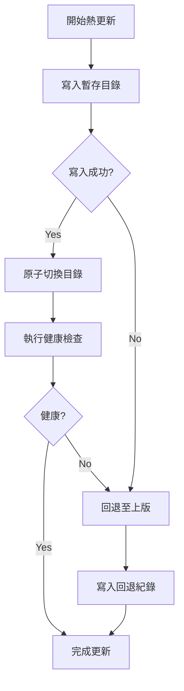

# 熱更新穩定性改進計畫

## 目標
- 防止熱更新導致程式崩潰
- 自動回退機制，失敗即恢復至上一次穩定版本
- 全自動化流程，最小化人工干預

## 現行問題
| 症狀 | 可能原因 |
|------|----------|
| 程式在熱更新後立即崩潰 | 新版檔案未完整寫入、相容性問題、設定未同步 |
| 更新失敗後無法回復 | 缺乏版本快照與回退指令、無健康檢查 |

## 改進方案
1. **版本快照與原子交換**：使用 `fs‑extra` 於 `npm start` 前拷貝 `client/` 至 `versions/v{timestamp}`，熱更新寫入暫存目錄後原子切換。
2. **健康檢查**：新版本啟動後執行 `healthCheck.js`，檢查模組、設定、IPC 註冊，失敗則觸發回退。
3. **自動回退機制**：`versionManager.rollback(versionId)` 重新還原快照並寫入 `部署記錄.md`。
4. **熱更新流程圖**：

5. **CI/CD 整合**：在 `deploy.bat` 加入快照產生腳本，部署完成後自動執行 `npm run hot-update`。
6. **監控與告警**：使用 `electron‑log` 記錄每一步，錯誤時發送系統通知或寫入 `部署記錄.md`，可在 `config.json` 開啟 `autoNotifyOnHotUpdateFailure`。

## 時程與里程碑
| 里程碑 | 內容 | 估計工時 |
|--------|------|----------|
| M1 | 建立版本快照與原子切換程式 (`versionManager.js`) | 4h |
| M2 | 實作健康檢查腳本與回退流程 | 3h |
| M3 | 整合至 `deploy.bat` 與 CI 流程 | 2h |
| M4 | 撰寫測試腳本、手動驗證與自動化測試 | 3h |
| M5 | 完成文件與部署記錄更新 | 1h |

## 風險與因應
- **磁碟空間**：保留最近 5 版，超過自動刪除舊版。
- **跨平台差異**：`fs.renameSync` 在 Windows 可能失敗，改用 `fs‑extra.move` 並加 `overwrite:true`。
- **使用者自行修改 `client/`**：熱更新前檢查目錄差異，若有變更提示備份。

## 後續驗證
1. **單元測試**：模擬寫入失敗、健康檢查失敗，驗證回退路徑正確。
2. **整合測試**：本機執行 `npm run hot-update`，觀察 UI 正常啟動，失敗時自動回到舊版。
3. **實機驗證**：正式環境部署一次熱更新，確認 `部署記錄.md` 正確記錄，使用者無感知中斷。
